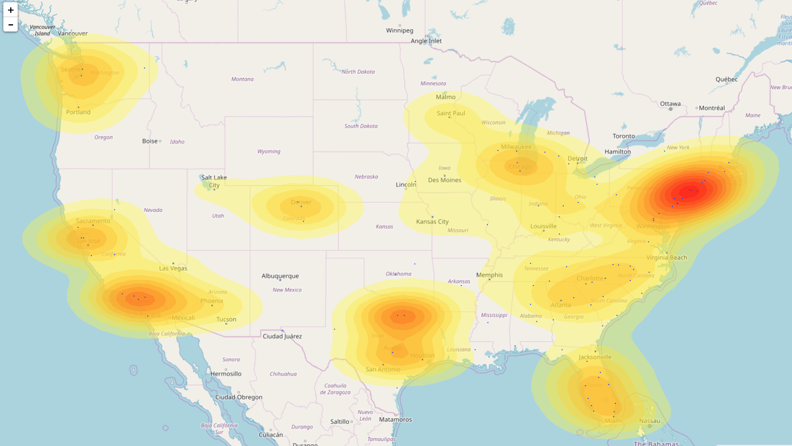

# Territory-Analysis

In order to decide where to hire new business development (sales) roles for a co-living startup, data on multi-family development projects was requested from a paid source.

To minimize travel time for salespeople, the data was geocoded and used to visualize a weighted density heatmap of multi-family development activity in the United States.

## Data Structure
The data is comprised of two major columns, metro area in one, and number of multifamily development projects in 2017 in the other.

## Parsing and Cleaning
In order to do any geomapping easily, it was necessary to convert these metro areas to latitudes and longitudes.

The google maps geocoding API exposes google's map search capability in order to return a geolocation at the center of any municipality.

Therefore, the metro areas, with names like 'Denver-Aurora-Lakewood, CO', had to be split into their constituent cities for search.

The jupyter notebook, in the `notebooks` folder in this repo, describes the parsing and dataframe construction in detail.

## Geocoding
Once the city and state names were parsed, a for loop was employed to iterate over each city, construct a API query string, fetch the results, and traverse the returned response object to acquire the latitude and longitude. These geolocations were then married to the dataframe.

## Output
The dataframe was then subset to give just three columns:
* latitude
* longitude
* value

This new dataframe was exported as a csv, and uploaded to a freely available web server running leaflet.js to save time, at [www.heatmapper.ca/](Heatmapper)

The resulting visualization was exported as an .html file, and can be opened in the browser as an interactive, zoomable map.